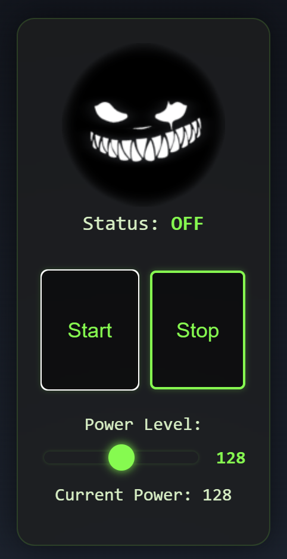

# ESP32 Ultrasonic Voice Jammer

## Table of Contents

- [Overview](#overview)
- [Features](#features)
- [Components](#components)
- [Setup Instructions](#setup-instructions)
  - [1. Wiring the ESP32 to the Amplifier Board](#1-wiring-the-esp32-to-the-amplifier-board)
  - [2. Connecting 25kHz Transducers](#2-connecting-25khz-transducers)
- [Usage](#usage)
- [Customization](#customization)
- [Contributing](#contributing)
- [License](#license)
- [Acknowledgements](#acknowledgements)

## Overview

The **ESP32 Ultrasonic Voice Jammer** is a project designed to disrupt voice communications by emitting ultrasonic frequencies. Based on the innovative work of [MCORE1976](https://github.com/MCORE1976), this project leverages the powerful ESP32 microcontroller to generate and control ultrasonic signals, effectively jamming targeted audio frequencies.

> **Disclaimer:** This project is intended for educational and experimental purposes only. Unauthorized use to interfere with communications is illegal and unethical.

## Features

- **ESP32 Integration:** Utilizes the versatile ESP32 microcontroller for signal generation and control.
- **High-Frequency Transmission:** Capable of emitting ultrasonic frequencies up to 25kHz.
- **Adjustable Power Output:** Control the intensity of the ultrasonic signal via an amplifier board.
- **Compact Design:** Easy to integrate into various setups and housings.
- **Open-Source:** Fully open-source with customizable firmware and hardware components.

> 
## Components

- **ESP32 Development Board**
- **Amplifier Board** (compatible with ESP32)
- **25kHz Ultrasonic Transducers**
- **Power Supply** (appropriate for ESP32 and amplifier)
- **Connecting Wires**
- **Breadboard** (optional for prototyping)
- **Soldering Equipment** (if permanent connections are desired)

## Setup Instructions

### 1. Wiring the ESP32 to the Amplifier Board

Follow these steps to connect the ESP32 to the amplifier board:

1. **Power Connections:**
   - **ESP32 3.3V** → **Amplifier VCC**
   - **ESP32 GND** → **Amplifier GND**

2. **Signal Connections:**
   - **ESP32 GPIO Pin** (e.g., GPIO 18) → **Amplifier Input IN+**
   - **ESP32 GND** → **Amplifier Input IN-**

   > **Note:** Refer to your specific amplifier board's datasheet for exact pin configurations.

3. **Power Supply:**
   - Connect an appropriate power source to the amplifier board, ensuring it matches the voltage and current requirements.

### 2. Connecting 25kHz Transducers

To attach the ultrasonic transducers:

1. **Identify Transducer Terminals:**
   - Typically, transducers have two terminals: positive (+) and negative (-).

2. **Connect to Amplifier Outputs:**
   - **Amplifier Output OUT+** → **Transducer Positive (+)**
   - **Amplifier Output OUT-** → **Transducer Negative (-)**

3. **Secure Connections:**
   - Use soldering for permanent setups or breadboard jumper wires for prototyping.

4. **Mounting:**
   - Position the transducers in desired locations, ensuring they are securely fixed and have unobstructed pathways for sound emission.

## Usage

1. **Power On:**
   - Ensure all connections are secure.
   - Power on the ESP32 and amplifier board.

2. **Firmware Operation:**
   - The ESP32 runs firmware that generates ultrasonic signals at 25kHz.
   - Connect to the Antispy AP with password123 and control the jammer.

3. **Testing:**
   - Verify the ultrasonic emission using a frequency analyzer or compatible microphone.
   - Adjust settings as necessary to achieve the desired jamming effect.

## Customization

- **Firmware Modifications:**
  - Access the source code to modify frequency ranges, modulation patterns, or control interfaces.
  - Utilize the ESP32's Wi-Fi capabilities to integrate remote control features.

- **Hardware Upgrades:**
  - Experiment with different amplifier boards for varying power outputs.
  - Use multiple transducers to increase coverage area.

## Contributing

Contributions are welcome! Please follow these steps:

1. **Fork the Repository**
2. **Create a Feature Branch:** `git checkout -b feature/YourFeature`
3. **Commit Changes:** `git commit -m 'Add some feature'`
4. **Push to Branch:** `git push origin feature/YourFeature`
5. **Open a Pull Request**

Please ensure your contributions adhere to the project's coding standards and include appropriate documentation.

## License

This project is licensed under the [MIT License](LICENSE).

## Acknowledgements

- **[MCORE1976](https://github.com/MCORE1976):** For the foundational work that inspired this project.
- **Open-Source Contributors:** For their invaluable contributions to similar projects.

---

*For any questions or support, please open an issue on the [GitHub repository](https://github.com/scs-labrat/antispy-esp32-ultrasonic-voice-jammer).*

